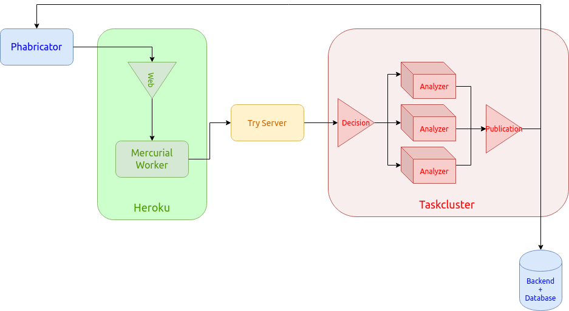

# Architecture

The code review bot is not a single piece, but a distributed system using several providers.

[Source](architecture.drawio) to use on [draw.io](https://app.diagrams.net/).

## Workflow

1. For every new diff on the [Mozilla Phabricator instance](https://phabricator.services.mozilla.com/), an Harbormaster build is created (more details on the [Phabricator page](phabricator.md)
2. The build triggers an HTTP request towards a Taskcluster Hook
3. The Taskcluster hook triggers a new bot task in analysis mode
4. That task then fetches the stack of patches, and tries to apply them locally,
5. If the stack fails to apply, an error is reported directly on the Phabricator revision,
6. If the stack applies cleanly, it's pushed on the Try server, exactly like a developer would do,
7. The Try server creates a decision task on Taskcluster,
8. The Decision tasks creates followup tasks, with code analyzers, and a custom code-review task.
9. The code analyzers run on the stack we produced, and list potential issues in a JSON file, that is stored and shared as a Taskcluster artifact,
10. The final code-review task is triggered once all analyzers complete and just sends a Pulse message.
11. The pulse messages triggers our own task hosted in a Taskcluster hook (see [bot](projects/bot.md) for more information)
12. That task retrieves all the analyzers artifacts with issues, filters them, and updates the Phabricator build, reporting potential issues.
13. That same task also publishes the issues on our backend hosted on Heroku (see [backend](projects/backend.md) for more information).

The whole workflow takes about 12 to 15 minutes on average for a given revision.

## Analyzers

The whole project relies on the code analyzers defined on the target repositories. They can produce issues detected by static analyzers, or formatting issues, with patches to improve the code quality.

We currently support several analyzers used in Mozilla central:

- clang-format
- clang-tidy
- mozlint (bringing a huge list of analyzers like flake8, eslint, rustfmt, ...)

All those analyzers output a different JSON payload, hence the need for different implementations. But we also have a [default format](analysis_format.md) that is recommended if you want to add a new analyzer.

In an ideal world, we would only support that format, and convert the existing analyzers to output a compatible payload.

## Publication task

You may have noticed the _pulse message dance_ in the workflow above. It may seem weird to add a task only sending a Pulse message to trigger another task in the same Taskcluster instance.

This has brought us several advantages:

- we do not [ever](https://hg.mozilla.org/mozilla-central/log/tip/taskcluster/ci/code-review/kind.yml) need to update the first task, so we do not have a direct dependency on mozilla-central
- we can update the publication code (the **bot** part) easily, just like any other Taskcluster hook payload
- we can trigger the hook from different projects, with different rules and workflows
- we get a trigger history for free thanks to the Taskcluster hook system
- we can run several versions of the hook in parallel (the testing environment can receive the same pulse messages than production, allowing to run in _shadow mode_ - see [debugging](debugging.md) for that)

## Backend

The backend is hosted on a single Heroku web dyno at https://api.code-review.moz.tools and linked to an Heroku Postgres database. This setup would allow us to scale easily if the need arises.

The Django web framework is used to build an efficient REST API (with [django-rest-framework](https://www.django-rest-framework.org/)), based on the official ORM system.

Its main purpose is to store issues reported by the publication task at the end of its run, so that they can be retrieved later on by the frontend, if some developer wants to see the reports for any revision in more details.

For more information, read the [backend](backend.md) documentation.

## Frontend

The frontend is a simple [Vue.js](https://vuejs.org) Single Page Application hosted under an S3+Cloudfront bucket as https://code-review.moz.tools.
It uses the backend as its main source of information, no authentication is implemented as all information is already public (we do not support security bugs).

With the frontend, you can:

- browse analysis tasks (also called reports)
- search them by revision, bugzilla id, name, ...
- list all the issues detected in a diff
- compare the evolution of issues in a revision, across diffs
- view the publication statistics (which analyzers report the most, ...)
- view issues per analyzers
