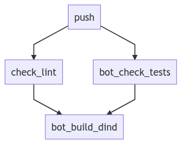
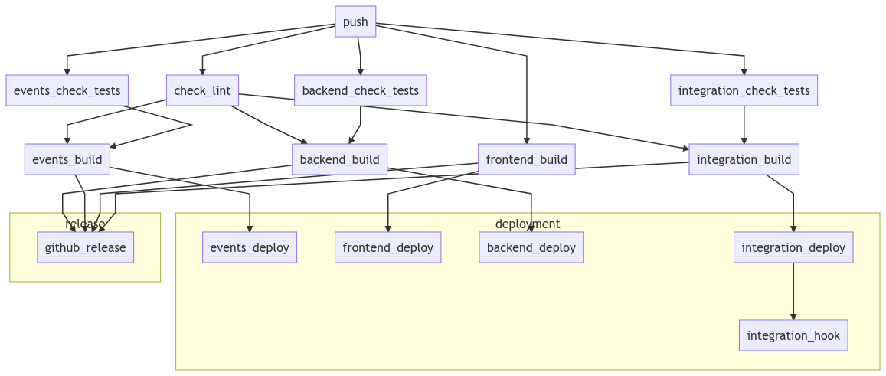

# CI/CD Pipeline with Taskcluster

The code review bot relies **extensively** on Taskcluster, to run publication tasks, code analysis, but also to build and ship the code-review bot itself.

We use both Mozilla's Taskcluster instances:

- [firefox-ci](https://firefox-ci-tc.services.mozilla.com/) to build and run the bot project
- [community](https://community-tc.services.mozilla.com/) to build the other projects

We use a pretty simple convention related to the git workflow:

1. Every pull request triggers a pipeline of tasks check unit tests, code format, ultimately building docker images.
2. The `master` branch must always be _clean_ and deployable. That branch is protected.
3. Tags are only used to represent a release, using semantic versioning (example on [release 1.2.1](https://github.com/mozilla/code-review/releases/tag/1.2.1))
4. A push on `testing` will run the full pipeline, building Docker images, and deploying them on the different providers for the **testing** environment (Taskcluster & Heroku)
5. A push on `production` will run the full pipeline, building Docker images, and deploying them on the different providers for the **production** environment (Taskcluster & Heroku)

## Firefox-CI instance


[Graph source code](firefox-ci.mermaid)

The CI/CD workflow is really simple on the firefox-ci instance. On every Github push (branch, pull request, tag), we run the following tasks:

- `check_lint` checks the formatting of all files
- `bot_check_tests` runs the bot unit tests
- `bot_build_dind` builds the bot's Docker image using Docker In Docker (dind), stores the image as a public artifact, and the task is always indexed.

That last task is interesting because it allows us to ship immediately updates for the code review bot in the Taskcluster firefox-ci instance without relying on a remote Docker repository: the image is built in Taskcluster and stays there. Other tasks can use our docker image by referencing it through the [Taskcluster task-image](https://firefox-source-docs.mozilla.org/taskcluster/docker-images.html) feature.

You can view that usage in the bot's [production](https://firefox-ci-tc.services.mozilla.com/hooks/project-relman/code-review-production) & [testing](https://firefox-ci-tc.services.mozilla.com/hooks/project-relman/code-review-testing) hooks.

### Routes

On a github pull request, the docker image is indexed as below. `head_rev` is the revision sha hash, `head_branch` is the remote branch name.

```
index.code-analysis.v2.code-review-pr.revision.${head_rev}
index.code-analysis.v2.code-review-pr.branch.${head_branch}
```

On a github branch push (especially for **testing** & **production** branches) as below. `head_rev` is the revision sha hash, `head_branch` is the local branch name.

```
index.code-analysis.v2.code-review.revision.${head_rev}
index.code-analysis.v2.code-review.branch.${head_branch}
```

As mentioned in the previous paragraph, the pre-configured hooks rely on the `index.code-analysis.v2.code-review.branch.testing` & `index.code-analysis.v2.code-review.branch.production` indexes.

### Configuration

The firefox-ci configuration is stored in https://github.com/mozilla-releng/fxci-config/

To make changes, lookup the relevant code-review sections in the `grants.yml`, `hooks.yml` and `projects.yml` files. You'll need to submit your patch on Phabricator, linked to a Bugzilla bug filed under **Release Engineering :: Firefox-CI Administration** (example on [Bug 1604227](https://bugzilla.mozilla.org/show_bug.cgi?id=1604227))

You can also ask for help on Matrix #firefox-ci channel.

## Community instance


[Graph source code](community.mermaid)

As you can see, it's a bit more complicated on the Community instance. But the goal is similar: we only aim to build Docker images continuously and deploy them on their target when we push on the corresponding deployment branches (testing & production).

On every Github push (branch, pull request, tag), we run the following tasks:

- `check_lint` checks the formatting of all files
- `backend_check_tests` runs the backend unit tests
- `integration_check_tests` runs the integration unit tests
- `backend_build` builds the backend's Docker image using img and a privileged worker, and stores it as a public artifact
- `integration_build` builds the integration's Docker image using img and a privileged worker, and stores it as a public artifact
- `frontend_build` builds the frontend static files and stores them as Taskcluster artifacts

On a tag push, we trigger another task:

- `github_release` will create a release with notes on Github

On a deployment (push on `testing` or `production`), we trigger those deployment tasks:

- `backend_deploy` deploys the backend docker image on Heroku web dyno
- `integration_deploy` pushes the integration docker image on a docker registry
- `integration_hook` updates the integration Taskcluster hook to use the new docker image
