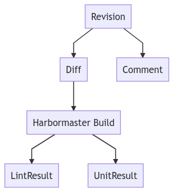

# Phabricator

The main goal of the project was to publish issues on Phabricator, so we need a good integration with their API and interface.

## Structure

[Graph source](phabricator.mermaid)

Developers interact with Phabricator **Revision** objects: when they push a patch, it creates a new revision.

The patch is a **Diff**, linked to a unique **Revision**. When a developer updates its patch, the **Revision** gets a new **Diff**. The latest **Diff** is displayed by default when viewing a **Revision** on the Phabricator web interface.

Phabricator instances can be configured with [Herald rules](https://secure.phabricator.com/book/phabricator/article/herald/) to react to internal events. This allows us to get a new [Harbormaster build](https://secure.phabricator.com/book/phabricator/article/harbormaster/) for every new patch.

An **Harbormaster build** is made so that external tools (like the code review bot) can analyze a **Diff** and report back on its status. It can have 3 states:

- `work` when the build is in progress,
- `pass` when the build is valid (no issues),
- `fail` when an issue was detected.

The `pass` and `fail` states are final. Once reported on the build, its state cannot be updated anymore.

It's possible to restart a build (as an administrator on production, as owner of the revision in testing), so you can have multiple builds per **Diff**.

When some issues are detected, they are reported as **LintResult**. Phabricator will display them as a list at the top of the **Revision**, with their name, and code, linking to their location in the patch.

Unit test failures could also be reported through **UnitResult** in the same way.

When a build is restarted, or a new diff is created, previous results are cleared and not shown anymore.

Lastly it's possible to publish a **Comment** on the revision, but it will not be tied to a **Diff** or **Harbormaster Build**. We use that to publish generic and persistent information about issues (the summary comment).

## API

To interact with Phabricator, we need to use their _~REST_ API. It's self documented on the `/conduit` endpoint:

- https://phabricator.services.mozilla.com/conduit/ for the production instance
- https://phabricator-dev.allizom.org/conduit/ for the testing instance

Our Phabricator API client is developed in a separate repository [libmozdata](https://github.com/mozilla/libmozdata/blob/master/libmozdata/phabricator.py), but still maintained by the same team.

Please note that the Phabricator API use a _weird_ style to pass parameters (only POST requests, with a JSON payload inside a dict urlencoded: use the existing client instead of writing your own).

## Endpoints

All the endpoints we use in the project are implemented with some high level function in the Phabricator API client hosted in libmozdata.

| Endpoint                     | Description                                                                                 |
| ---------------------------- | ------------------------------------------------------------------------------------------- |
| differential.createcomment   | Publish a comment on a Revision                                                             |
| differential.diff.search     | Lookup a Phabricator Diff                                                                   |
| differential.getrawdiff      | Get the raw patch for a given Diff, hosted on Phabricator, not HGMO                         |
| differential.revision.search | Lookup a Phabricator Revision                                                               |
| diffusion.repository.search  | Get details for a repository, or a list of supported repositories                           |
| harbormaster.build.search    | Search for a build on a diff/revision                                                       |
| harbormaster.createartifact  | An artifact can be a file or a link: used to publish the treeherder link on a Build.        |
| harbormaster.sendmessage     | Update a build state, and publishes results (issues).                                       |
| transaction.search           | List internal transactions for an object, to identify if a comment has already been posted. |
| user.whoami                  | Load current authenticated user, to check credentials.                                      |

## Subtleties

### ID and PHID

Phabricator uses two IDs per object: a numerical value `ID`, which is exposed to users, and an internal ID, called the `PHID`, largely used in the API (it looks like `PHID-XXX-YYYYYY`)

### Search

To get details about a specific object, you need to use the `xxx.search` endpoint with an ID constraint. There is no `xxx.details` endpoint. You'll see that a lot in libmozdata.

### Unit tests

There is an extensive test suite in the bot, using several mockups to build fake Phabricator [responses](https://github.com/getsentry/responses). The Conduit team has also a great test system in the lando-api project - it would be great to share that as a library.

## Help

The EngFlow and Conduit team will help you for troubleshooting issues and building great features: they're available on Matrix #conduit.
