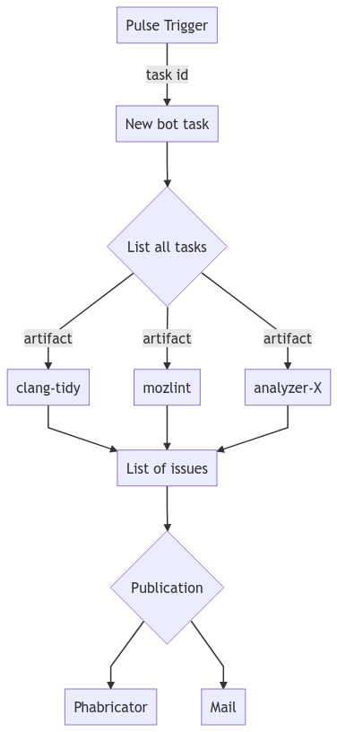

# Code review Bot

The publication task (also called **bot**) is a Python script, running as a Taskcluster task.

The technical information on how to get started is available in the [project README](/bot/README.md).

## Deployment

The project is built as a Docker in Docker image, on the firefox-ci instance (more information in [CI/CD](/docs/ci-cd/README.md)).

Two hooks are available and configured through [ci-configuration](https://github.com/mozilla-releng/fxci-config/blob/main/hooks.yml):

- [project-relman/code-review-production](https://firefox-ci-tc.services.mozilla.com/hooks/project-relman/code-review-production)
- [project-relman/code-review-testing](https://firefox-ci-tc.services.mozilla.com/hooks/project-relman/code-review-testing)

## Workflow

The overall workflow of the publication task is relatively simple:

- The code review hook is triggered by a pulse message, starting a new task for each completed analysis
- List all Taskcluster tasks in the analysis
- Instantiate a task parser for each taskcluster task
- Build issues for each tasks
- Aggregate them
- Publish them on Phabricator


[Graph source](bot.mermaid)

### Publishable issues

We publish only a subset of issues detected:

- every **Error** is reported, no matter where it's detected.
- **Warnings** that are inside the patch (modified lines of files in patch) are reported

Other warnings are discarded (but still reported in debug and backend mode)

## Supported tasks

Each analyzer must be supported by the bot, in order to convert the JSON artifacts into a list of issues.

The first half part of the workflow is to convert JSON files into a list of `code_review_bot.Issue` sub classes instances.

Each `code_review_bot.Issue` has a common interface to build Phabricator LintResult and comments (amongst other outputs).

### Clang-Tidy

This supports the `source-test-clang-tidy` task from mozilla-central, and parses the custom artifact `public/code-review/clang-tidy.json`.

It will output a list of `ClangTidyIssue`, reporting static analysis warnings. A few extra filtering rules are present.

### Clang-Format

This supports the `source-test-clang-format` task from mozilla-central, and parses the custom artifact `public/code-review/clang-tidy.diff`. (Only task to use a diff directly)

It will output a list of `ClangFormatIssue`, reporting formatting warnings, with fixes provided to the developer.

### Mozlint

This supports all the Mozlint tasks (and there are a lot!) from mozilla-central. It parses the custom artifact and mozlint json format defined in `public/code-review/mozlint.json`.

It will output a list of `MozLintIssue` reporting on various issues for most languages in Mozilla central.

### Default format

We also built a default task support & format, described in extensive details [here](/docs/analysis_format.md).

This format should be used by new analyzers, as this does not require any change in the bot!

## Reporters

The publication task support several reporters to publish issues. They are defined in the shared [configuration](/docs/configuration.md).

### Phabricator

This is definitely the most important reporter. It will publish all issues deemed publishable on the Phabricator revision & build being analysed.

We publish two things (when issues are published):

- a summary comment listing the number of issues found, their type, and some help text
- one **LintResult** per issue found.

For more information, read the [phabricator](/docs/phabricator.md) documentation.

See below, how to [test the publication on Phabricator](#test-the-publication-on-phabricator).

### Debug

The debug reporter lists all the issues in a public JSON artifact and sends an email to admins with the full list of issues.

It could be deprecated now that we have better tracking and management of issues (it was the first reporter created, a long time ago).

### Build error

Build errors are really bad, and we want to send an email to the developer when they occur. So this reporter simply sends an email to the developer using Taskcluster notification system.

### Backend

The backend has no reporter as it's more tightly coupled to the bot system, but every issue is published on the backend.

Each Issue also has a unique hash calculated, using the modified lines source code, the issue summary. It's used to be able to compare issues between each other.

## Test the publication on Phabricator

### Submit a fake patch on Firefox

There is an [online documentation](https://firefox-source-docs.mozilla.org/contributing/contribution_quickref.html) that explains how to publish a patch on Firefox. Here are a few tips on how to simplify/accelerate this workflow.

In the repository, you can install dependencies using the command:

```
./mach bootstrap
```

:warning: Using `./mach build` as suggested in the documentation will result in a build that can take forever to complete.

Make a patch by editing one of Firefox files and then run the desired linter using the command:

```
./mach lint -l my_linter
```

For example, to run flake8 on the repository, you can use:

```
./mach lint -l flake8
```

### Retrieve `TRY_TASK_GROUP_ID` and `TRY_TASK_ID`

Once you have submitted a patch on Phabricator using `moz-phab`, you'll need to retrieve two values to run the Code Review Bot locally on this specific diff.

First, you have to find your patch on Phabricator, for example, this one was created for testing purposes:
https://phabricator.services.mozilla.com/D150515

Then you have two ways to retrieve the desired information.

#### First option

1. On the Phabricator page for your diff, find the **Build 111111: Source Code Analysis** link in the **Diff Detail** panel, next to the **Build Status** label.
2. Next to this link, you should have a link called **CI (Treeherder) Jobs**, click on it and you'll be redirected to Treeherder.
3. On the Treeherder page, find the green **D** next to **Gecko Decision Task opt** and click on it, a panel will appear on the bottom of the page.
4. On the left side of the newly opened panel, find the **Task** label and click on the task ID link next to it, a Taskcluster page will open.
5. On the top of the page, click on the **Task Group** link, next to **Gecko Decision Task**.
6. There you can retrieve the ID after `https://firefox-ci-tc.services.mozilla.com/tasks/groups/` in the URL, that's the `TRY_TASK_GROUP_ID` needed to launch the Code Review Bot.
7. Once you have this first ID, you can find the task named **code-review-issues** in the displayed list, click on it.
8. There you can retrieve the ID after `https://firefox-ci-tc.services.mozilla.com/tasks/` in the URL, that's the `TRY_TASK_ID` needed to launch the Code Review Bot.

**_Example_**

1. On https://phabricator.services.mozilla.com/D150515
2. Redirected to https://treeherder.mozilla.org/jobs?repo=try&revision=5ec034a3e77223ee58d2bad5689b99e09c61a4bb
3. Panel opened https://treeherder.mozilla.org/jobs?repo=try&revision=5ec034a3e77223ee58d2bad5689b99e09c61a4bb&selectedTaskRun=Y44yN6dtSsWQ6oyTYMYhQw.0
4. Redirected to https://firefox-ci-tc.services.mozilla.com/tasks/Y44yN6dtSsWQ6oyTYMYhQw
5. On https://firefox-ci-tc.services.mozilla.com/tasks/groups/Y44yN6dtSsWQ6oyTYMYhQw
6. Here `TRY_TASK_GROUP_ID=Y44yN6dtSsWQ6oyTYMYhQw`
7. On https://firefox-ci-tc.services.mozilla.com/tasks/LfiiQNAXR4WV9e1RT4PVsQ
8. Here `TRY_TASK_ID=LfiiQNAXR4WV9e1RT4PVsQ`

#### Second option

1. On the Phabricator page for your diff, retrieve your diff ID in the URL after `https://phabricator.services.mozilla.com/D`.
2. Then go to `https://firefox-ci-tc.services.mozilla.com/tasks/index/project.relman.production.code-review.phabricator.<diff_id>`.
3. Click on the first Indexed Task.
4. Under the **Data** label you'll have a JSON payload containing both needed information, `try_task_id` and `try_group_id`.

**_Example_**

1. On https://phabricator.services.mozilla.com/D150515, here `diff_id=150515`
2. Go to https://firefox-ci-tc.services.mozilla.com/tasks/index/project.relman.production.code-review.phabricator.150515
3. On https://firefox-ci-tc.services.mozilla.com/tasks/index/project.relman.production.code-review.phabricator.150515/AUAnqdfRTPq64aBFHS0g3Q
4. Here `TRY_TASK_ID=LfiiQNAXR4WV9e1RT4PVsQ` (`try_task_id`) and `TRY_TASK_GROUP_ID=Y44yN6dtSsWQ6oyTYMYhQw` (`try_group_id`)

### Launch the Code Review Bot

An example of a working development configuration:

```
---
bot:
  ZERO_COVERAGE_ENABLED: false
  REPORTERS:
    - reporter: phabricator
  backend:
    username: <backend_user>
    url: 'http://localhost:8000'
    password: <backend_password>

common:
  APP_CHANNEL: dev

  PHABRICATOR:
    api_key: <phab_api_token>
    url: 'https://phabricator.services.mozilla.com//api/'
    publish: true

  repositories:
    - checkout: robust
      try_url: 'ssh://hg.mozilla.org/try'
      try_name: try
      name: mozilla-central
      ssh_user: <ssh_user>
      url: 'https://hg.mozilla.org/mozilla-central'
      decision_env_prefix: GECKO
```

**Note**: You can generate/find your Phabricator API Token on this page: https://phabricator.services.mozilla.com/settings/user/--phabricator_username--/page/apitokens/.

Then, you can create a script named `code_review_testing.sh`, containing the following lines:

```
export TRY_TASK_GROUP_ID="<TASK_GROUP_ID>"
export TRY_TASK_ID="<TASK_ID>"

code-review-bot -c <path/to/your/configuration>.yml
```

Run the script with:

```
bash code_review_testing.sh
```

:tada: A new comment should have been published! :tada:
